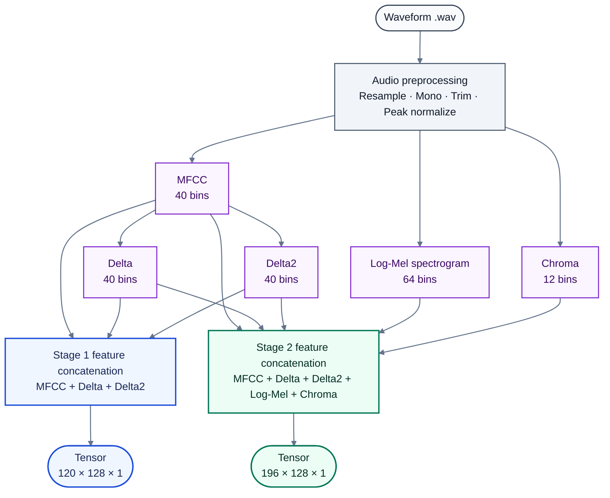
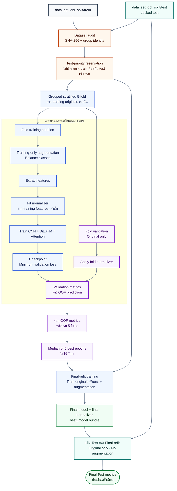

# CryInsight Model Architecture and Training Protocol

เอกสารนี้อธิบายสถาปัตยกรรม การเตรียมข้อมูล การเพิ่มข้อมูล (augmentation) วิธีฝึก และวิธีประเมินโมเดล CryInsight ตาม implementation ปัจจุบัน โดยระบบแบ่งเป็น 2 ขั้นเพื่อแยกคำถามว่า “เป็นเสียงทารกหรือไม่” ออกจากคำถามว่า “เสียงทารกอยู่ในกลุ่มเชิงปฏิบัติการใดตาม Dataset”

> Shared Experiment Engine ใช้ทดสอบทางเลือกโดยไม่แก้ `Models_dbl/Main/train_main_dbl.py` หรือ `Models_dbl/binary/train_binary_dbl.py` การแก้ trainer หลักจะเกิดได้หลัง Candidate ผ่าน Wave C, Promotion Gate และได้รับอนุมัติแยกต่างหากเท่านั้น

## 0. Pipeline Run 1 และ GPU provenance

Pipeline Run หลักปัจจุบันคือ `20260821T164332Z_490383ff` โดย Stage 1 และ Stage 2 มี `verification.json` สถานะ `complete`, ใช้ Run ID เดียวกัน และ Stage 2 บันทึกหลักฐานการจับคู่กับ Stage 1 ไว้ใน `run_config.json` ผลจาก Run นี้เป็น baseline สำหรับ Shared Experiment Engine ไม่ใช่ผลจาก experiment candidate

| Runtime field | ค่าที่บันทึกใน Stage 1 และ Stage 2 |
|---|---|
| Operating environment | WSL2 Ubuntu 22.04 (`Linux 6.6.87.2-microsoft-standard-WSL2`) |
| Python | 3.10.12 (`/home/adminuser/.venvs/audio-ml-gpu/bin/python`) |
| TensorFlow / Keras | 2.21.0 / 3.12.4 |
| Accelerator | `GPU:0`, NVIDIA GeForce RTX 5070 Ti |
| CUDA / cuDNN | 12.5.1 / 9 |
| Device policy | `requested_device: gpu`, `require_gpu: true`, `selected_device: gpu` |
| Precision policy | `mixed_float16` |

GPU ทำให้การฝึก Candidate และ 5-fold protocol ใช้เวลาเหมาะสมขึ้น แต่ไม่ได้เปลี่ยน train/test split, grouping, fold assignment, loss หรือหลักเกณฑ์การประเมิน จึงไม่ควรอ้างว่า GPU ทำให้ accuracy เพิ่มขึ้นโดยตัวมันเอง

สรุปผล Final-refit บน locked internal held-out Test คือ Stage 1 accuracy 99.42% และ Macro F1 99.41% (support 694); Stage 2 accuracy 92.41% และ Macro F1 91.02% (support 303) รายละเอียดและ uncertainty interval อยู่ใน [Pipeline Run 1 Report](./Report/runs/report_01_20260821.md)

## 1. ภาพรวมระบบ

```text
ไฟล์เสียง .wav
        │
        ▼
Stage 1: Binary Baby Gate
CNN + MFCC/Delta/Delta2 + BiLSTM + Attention
"เป็นเสียงทารกหรือไม่?"
        │
        ├── not_baby ──► หยุดและแจ้งว่าไม่ใช่เสียงทารก
        │
        └── baby
              │
              ▼
Stage 2: Five-class Infant State Classifier
CNN + MFCC/Delta/Delta2/Log-Mel/Chroma + BiLSTM + Attention
"เสียงทารกอยู่ในกลุ่มใด?"
              │
              ▼
belly_pain / burping / discomfort / hungry / tired
พร้อมคะแนนจาก Softmax ที่ยังไม่ผ่านการปรับเทียบ
```

เหตุผลที่แบ่งเป็น 2 Stage คือให้ Stage 1 ทำหน้าที่กรองเสียงสิ่งแวดล้อมก่อน เพื่อไม่บังคับให้ Stage 2 เลือกหนึ่งใน 5 กลุ่มทารกเมื่ออินพุตไม่ใช่เสียงทารก โครงสร้างนี้ทำให้หน้าที่ของแต่ละโมเดลชัดเจนและนำไปเชื่อมกับ Web application ได้ตรงไปตรงมา

## 2. ข้อมูลที่ใช้

ข้อมูลต้นฉบับอยู่ใน `data_set_dbl` และถูกสุ่มแยกแบบรายคลาสประมาณ 80/20 เป็น:

```text
data_set_dbl_split/
├── train/   # ใช้สร้าง 5 folds และฝึกโมเดลเท่านั้น
└── test/    # locked held-out test ไม่ใช้ปรับโมเดล
```

ตัวแบ่งข้อมูลใช้ random seed เท่ากับ `42` เพื่อให้ทำซ้ำได้ อย่างไรก็ตาม การสุ่มระดับไฟล์อาจทำให้ไฟล์ที่มีเนื้อหาเหมือนกันหรือไฟล์จากแหล่งกำเนิดเดียวกันกระจายข้าม `train/test` ได้ ดังนั้น trainer จะตรวจ SHA-256 และ group identity อีกครั้งก่อนฝึก โดยให้ชุด `test` มีสิทธิ์ก่อนและไม่นำรายการใน `train` ที่ชนกับ test เข้าเทรน ทั้งนี้ไม่มีการลบไฟล์เสียงจริง

[InfantCry-DBL Version 1](https://data.mendeley.com/datasets/x493z8nmwc/1) (DOI: `10.17632/x493z8nmwc.1`) ระบุข้อมูล 1,551 clips และ local dataset มีจำนวนไฟล์ใน 5 infant labels ตรงกัน การ split ปัจจุบันแบ่งเป็น Train candidates 1,241 และ Test candidates 310 รวม 1,551 โดยไม่มีไฟล์หายระหว่างการ split

ผล audit ของ split ปัจจุบัน:

| Stage | Training หลังคัดกรอง | Held-out test หลังคัดกรอง | Group overlap หลังคัดกรอง | SHA-256 overlap หลังคัดกรอง |
|---|---:|---:|---:|---:|
| Stage 1 | 2,432 | 694 | 0 | 0 |
| Stage 2 | 1,045 | 303 | 0 | 0 |

จำนวนนี้อาจเปลี่ยนหากสร้าง split ใหม่ด้วย seed หรือข้อมูลต้นฉบับที่ต่างออกไป

### Stage 2 data accounting

จำนวน Stage 2 ที่ใช้ประเมินหลักคือ 1,348 eligible original records ไม่ใช่ 1,551 candidates ทั้งหมด เพราะ trainer ใช้กฎ exact-content deduplication และสงวน Test ก่อน Train:

| ขั้นตอน | Train | Test | รวม |
|---|---:|---:|---:|
| Candidate records หลัง split | 1,241 | 310 | 1,551 |
| ตัด same-label exact duplicates | −110 | −7 | −117 |
| ตัด cross-label exact duplicates | −6 | 0 | −6 |
| ตัด Train records ที่ exact-content ชน Test | −80 | 0 | −80 |
| **Eligible originals** | **1,045** | **303** | **1,348** |

สมการรวมคือ `1,551 − 117 − 6 − 80 = 1,348` โดย:

- same-label exact duplicates เก็บ canonical record หนึ่งรายการต่อ SHA-256
- cross-label exact duplicates จำนวน 6 records อยู่ใน 3 SHA-256 groups ที่มี label ขัดแย้งกัน จึงตัดทั้งกลุ่ม
- Train–Test overlap จำนวน 80 records มี SHA-256 ตรงกับ eligible Test records ครบทั้ง 80 รายการ จึงตัดฝั่ง Train เพื่อป้องกัน leakage
- eligible originals ทั้ง 1,348 records มี SHA-256 ไม่ซ้ำกัน และ Train/Test มี SHA-256 overlap เท่ากับ 0
- ไม่มี quality filtering, missing audio หรือการลบไฟล์จริงในความต่าง 203 records นี้

หลักฐานของ run อยู่ใน `dataset_audit.json`, `heldout_dataset_audit.json`, `record_audit.csv`, `heldout_record_audit.csv` และ `heldout_reservation.json`

### กฎเฉพาะ Stage 1

- คลาสทารกทั้ง 5 กลุ่มถูกรวมเป็น `baby`
- เสียงสิ่งแวดล้อมเป็น `not_baby`
- ESC-50 หมวด `crying_baby` (target 20) ถูกตัดออกจาก `not_baby` เพราะมีความหมายชนกับคลาสบวก
- เสียงทารกจัดกลุ่มด้วย exact-content SHA-256
- เสียง ESC-50 จัดกลุ่มด้วย `source_file` จากชื่อไฟล์ เพื่อไม่ให้หลาย take จากต้นเสียงเดียวกันกระจายข้าม fold

### กฎเฉพาะ Stage 2

- ใช้เฉพาะ `belly_pain`, `burping`, `discomfort`, `hungry` และ `tired`
- ไม่ใช้ `not_baby`
- exact duplicate ในคลาสเดียวกันเก็บ canonical record เพียงหนึ่งรายการ
- exact duplicate ที่พบข้ามคลาสถูกตัดทั้งกลุ่ม เพราะ label ขัดแย้งกัน

## 3. Audio preprocessing

ทั้งสอง Stage ใช้สัญญา preprocessing เดียวกันในส่วนเสียง:

| รายการ | ค่า | เหตุผล |
|---|---:|---|
| Sample rate | 22,050 Hz | เพียงพอสำหรับโครงสร้างเสียงร้องและลดภาระเมื่อเทียบกับ sample rate ที่สูงกว่า |
| Channel | Mono | ทำให้อินพุตทุกไฟล์มีรูปแบบเดียวกัน |
| Silence trimming | `top_db=20` | ลดช่วงเงียบที่ไม่ช่วยจำแนก |
| Waveform normalization | Peak normalization | ลดความต่างของระดับความดังระหว่างไฟล์ |
| FFT size | 2,048 samples | ให้รายละเอียดความถี่เหมาะกับงานเสียงทั่วไป |
| Hop length | 512 samples | กำหนดระยะเลื่อนระหว่างเฟรม |
| Maximum frames | 128 | ทำให้ทุกตัวอย่างมีขนาดคงที่สำหรับ CNN |
| Short-audio policy | Right zero-padding | ทำให้ไฟล์สั้นรองรับ Delta window ได้โดยไม่ทิ้งไฟล์ |
| Minimum samples | 4,096 | มาจาก `(delta_width - 1) × hop_length` เมื่อ `delta_width=9` |
| Data type | `float32` | เหมาะกับ TensorFlow และใช้หน่วยความจำน้อยกว่า float64 |

หาก feature มีน้อยกว่า 128 เฟรมจะเติมศูนย์ทางขวา หากยาวกว่า 128 เฟรมจะตัดให้เหลือ 128 เฟรม

## 4. Acoustic features

### MFCC

MFCC (Mel-frequency cepstral coefficients) จำนวน 40 coefficients สรุปลักษณะ spectral envelope ในสเกลที่ใกล้กับการรับรู้เสียงของมนุษย์ จึงเหมาะกับการแทน timbre และรูปแบบเสียงร้อง

### Delta และ Delta2

- `Delta` จำนวน 40 bins แทนการเปลี่ยนแปลงของ MFCC ตามเวลาในอันดับหนึ่ง
- `Delta2` จำนวน 40 bins แทนการเปลี่ยนแปลงอันดับสองหรือความเร่งของ MFCC

เสียงร้องไม่ได้มีเพียงลักษณะความถี่ ณ จุดใดจุดหนึ่ง แต่มีการไต่ระดับ การสั่น และการเปลี่ยนรูปตามเวลา Delta และ Delta2 จึงเพิ่มข้อมูลด้านพลวัตที่ MFCC แบบคงที่ไม่มี

### Log-Mel spectrogram

Log-Mel จำนวน 64 bands แสดงพลังงานตามเวลาและความถี่ใน Mel scale โดยเก็บรายละเอียด spectro-temporal มากกว่า MFCC เหมาะกับ Stage 2 ซึ่งต้องแยกความแตกต่างระหว่างกลุ่มเสียงทารกที่ใกล้เคียงกัน

### Chroma

Chroma จำนวน 12 bins รวมพลังงานตาม pitch class ช่วยเพิ่มมุมมองเกี่ยวกับโครงสร้างระดับเสียงและ harmonic content แม้เสียงร้องทารกไม่ใช่ดนตรี แต่ Chroma อาจช่วยแยกรูปแบบ pitch/harmonic ที่ MFCC และ Mel แทนได้ไม่เหมือนกัน

> การกล่าวว่า feature ใดช่วยเพิ่ม accuracy ต้องยืนยันด้วย ablation study การเลือก feature ในระบบนี้เป็นสมมติฐานการออกแบบตามโครงสร้างที่กำหนด ไม่ใช่หลักฐานว่า feature ชุดนี้ดีที่สุดสำหรับทุก corpus

## 5. Feature contract ของแต่ละ Stage

| Stage | Feature order | การคำนวณจำนวน bins | Input shape |
|---|---|---:|---|
| Stage 1 | MFCC + Delta + Delta2 | 40 + 40 + 40 = 120 | `(120, 128, 1)` |
| Stage 2 | MFCC + Delta + Delta2 + Log-Mel + Chroma | 40 + 40 + 40 + 64 + 12 = 196 | `(196, 128, 1)` |

Stage 1 ใช้ representation ที่กะทัดรัดกว่า เพราะเป้าหมายเป็น binary gate ระหว่าง `baby/not_baby` ส่วน Stage 2 เพิ่ม Log-Mel และ Chroma เพื่อให้โมเดลเห็นรายละเอียด spectral และ pitch เพิ่มเติมสำหรับปัญหา 5 คลาส

### Feature extraction flow



Delta และ Delta2 คำนวณต่อจาก MFCC ขณะที่ Log-Mel และ Chroma คำนวณจาก waveform หลัง preprocessing จากนั้นจึงเรียงและต่อ feature ตาม contract ของแต่ละ Stage

## 6. Stage 1 architecture

```text
Input (120, 128, 1)
  │
  ├─ Conv block 32 → MaxPool(2,2) : (60, 64)
  │
  ├─ Conv block 64 → MaxPool(2,2) : (30, 32)
  │
  ├─ Conv block 128 → MaxPool(2,1) : (15, 32)
  │
  ├─ Permute [feature,time,channel] → [time,feature,channel]
  ├─ Reshape เป็น time_sequence: (32, 15×128)
  ├─ Bidirectional LSTM 128
  ├─ Dropout 0.30
  ├─ Bidirectional LSTM 64
  ├─ Dropout 0.30
  ├─ Attention
  ├─ Dense 128 → BatchNorm → Dropout 0.40
  ├─ Dense 64 → Dropout 0.40
  └─ Softmax 2 classes
```

หน้าที่ของแต่ละส่วน:

- CNN เรียนรู้ลวดลายเฉพาะพื้นที่บน feature map เช่น formant, harmonics และการเปลี่ยนพลังงานระยะสั้น
- Batch normalization ช่วยให้การกระจาย activation มีเสถียรภาพระหว่างการฝึก
- pooling สอง block แรกลดทั้ง feature/time ส่วน block ที่สามลดเฉพาะ feature เพื่อรักษาเวลาไว้ 32 steps
- `Permute` ทำให้แกน sequence ของ BiLSTM เป็นเวลาอย่างตรวจสอบได้ ไม่ใช่ feature bins
- BiLSTM อ่านบริบททั้งทิศทางก่อนหน้าและถัดไปของลำดับเวลา 32 steps
- Attention เรียนรู้น้ำหนักของช่วงเวลาที่สำคัญ แทนการให้ทุกเฟรมมีผลเท่ากัน
- Dropout ลดความเสี่ยง overfitting
- Softmax ให้คะแนนสำหรับ `not_baby` และ `baby`

## 7. Stage 2 architecture

```text
Input (196, 128, 1)
  │
  ├─ Conv block 32  → MaxPool(2,2) : (98, 64)
  ├─ Conv block 64  → MaxPool(2,2) : (49, 32)
  ├─ Conv block 128 → MaxPool(2,1) : (24, 32)
  ├─ Conv block 256 → MaxPool(2,1) : (12, 32)
  │
  ├─ Permute [feature,time,channel] → [time,feature,channel]
  ├─ Reshape เป็น time_sequence: (32, 12×256)
  ├─ Bidirectional LSTM 128 → Dropout 0.30
  ├─ Bidirectional LSTM 64  → Dropout 0.30
  ├─ Attention
  ├─ Dense 256 → BatchNorm → Dropout 0.40
  ├─ Dense 128 → BatchNorm → Dropout 0.40
  ├─ Dense 64 → Dropout 0.30
  └─ Softmax 5 classes
```

Stage 2 มีสอง candidate ที่ต้องเลือกด้วย grouped OOF เท่านั้น:

- `corrected_single_branch` ใช้ feature tensor ต่อรวมตาม contract ข้างต้น
- `corrected_multi_branch` แยก `MFCC+Delta+Delta2 (0:120)`, `Log-Mel (120:184)` และ `Chroma (184:196)` เข้า CNN branch ของตนเอง แล้วรวม embedding ที่ time sequence 32 steps ก่อน BiLSTM

โครงสร้าง multi-branch ลดโอกาสที่ Conv kernel จะข้าม boundary ของ feature ต่างชนิดโดยตรง แต่ยังถือเป็น candidate ไม่ใช่ข้อสรุปว่าดีกว่า จนกว่าจะมีผล repeated-seed grouped OOF

## 8. Data augmentation

augmentation ใช้เฉพาะ training partition ภายในแต่ละ fold หลังแบ่ง train/validation แล้ว จึงไม่มี augmented sample ใน validation หรือ held-out test

ตัววางแผน augmentation จะเพิ่มตัวอย่างของแต่ละคลาสให้เท่ากับจำนวน original ของคลาสที่ใหญ่ที่สุดใน training partition ของ fold นั้น การ transform ถูกสร้างแบบ deterministic จาก seed และบันทึกใน `augmentation_manifest.csv`

Waveform augmentation ที่ trainer เลือกใช้:

| วิธี | หลักการ | เหตุผล |
|---|---|---|
| Gaussian noise | เติม noise ระดับต่ำ | เพิ่มความทนต่อ background noise |
| Pitch shift | เลื่อน pitch ขึ้นหรือลง | จำลองความแตกต่างของระดับเสียงระหว่างผู้ร้อง |
| Time stretch | ยืดหรือบีบเวลาโดยไม่เปลี่ยน label | จำลองความเร็วและระยะเวลาการร้องที่ต่างกัน |
| Time shift | เลื่อน waveform ตามเวลา | ลดการยึดติดกับตำแหน่งเริ่มต้นของเหตุการณ์เสียง |

ระบบ feature utility รองรับ amplitude scaling แต่ training augmentation plan ปัจจุบันไม่ได้เลือก transform นี้

### Stage 1

- ใช้ waveform augmentation เพื่อช่วย balance คลาสภายในแต่ละ fold
- ไม่ใช้ Mixup

### Stage 2

- ใช้ waveform augmentation เพื่อ balance คลาสภายในแต่ละ fold
- หลัง fit normalizer จาก training features แล้ว สร้าง Mixup เพิ่มค่าเริ่มต้น 500 ตัวอย่างต่อ fold
- ค่า Mixup alpha เริ่มต้นเท่ากับ `0.3`
- Mixup ผสมทั้ง feature tensors และ one-hot labels ของตัวอย่าง training เท่านั้น

## 9. Normalization และการป้องกัน leakage

แต่ละ Fold มี `per_feature_bin` normalizer ของตัวเอง ค่า mean/std มี shape `(feature_bins,1,1)` และคำนวณจาก Training features ของ Fold นั้นเท่านั้น จากนั้น broadcast ค่าเดิมไปยังทุก time frame/channel ของ Training และ Validation ใน Fold เดียวกัน

```text
fit mean/std: fold training originals + training augmentation
apply mean/std: fold training, fold validation
```

หลัง Cross-validation ระบบสร้าง Final-refit normalizer ใหม่จาก Training features ทั้งหมด และใช้ normalizer นี้กับ locked Test เพียงครั้งเดียว ห้าม fit normalizer จาก Validation หรือ Test ไฟล์ normalizer บันทึก mode, mean/std shape, feature order, block boundaries, preprocessing version, `run_id`, identity (`fold_N` หรือ `final_refit`) และ SHA-256 ตัวโหลดไฟล์ยังรองรับ `global_scalar` ของ bundle เก่าเพื่อ compatibility แต่ run ใหม่ใช้ `per_feature_bin`

Feature extraction ใช้ content-addressed cache ที่ key ครอบคลุม source SHA-256, preprocessing config/version, augmentation type/parameters/seed, dtype และ shape Cache ที่ hash/metadata ไม่ตรงถูก reject และไม่มีผลต่อ record/group identity

## 10. Five-fold training protocol

หลังสงวน test และตัด overlap จาก train แล้ว ข้อมูล train จะถูกแบ่ง 5 folds แบบ grouped stratification:

```text
Fold 1: train folds 2–5, validate fold 1
Fold 2: train folds 1,3–5, validate fold 2
...
Fold 5: train folds 1–4, validate fold 5
```

### Training and evaluation flow



Fold 1–5 ไม่โหลด feature ของ Test และไม่สร้าง Test metrics แต่ละ Fold เลือก checkpoint จาก Validation ของตนเองเท่านั้น เมื่อครบทุก Fold จึงนำ `best_epoch` ทั้ง 5 ค่ามาหาค่ามัธยฐาน สร้าง Final Model และ Final normalizer ใหม่จาก Train ทั้งหมด แล้วเปิด Test ประเมินเพียงครั้งเดียว

หลักการสำคัญ:

- Original record/group ถูกแบ่งก่อนสร้าง augmentation
- กลุ่มเดียวกันและ SHA-256 เดียวกันต้องไม่อยู่ทั้ง train และ validation
- Validation ใช้ original records เท่านั้น
- ทุก eligible training record ต้องเป็น validation exactly once เมื่อรวม OOF ทั้ง 5 folds
- ใช้ random seed `42` เป็นค่าเริ่มต้น
- checkpoint ของแต่ละ fold เลือก epoch ที่มี `val_loss` ต่ำที่สุด
- ใน WSL การเขียนทับ mutable Keras checkpoint ระหว่าง Epoch ทำบน native Linux filesystem จากนั้นเผยแพร่ selected checkpoint เข้า immutable Run folder เพียงครั้งเดียว พร้อมตรวจขนาดและ SHA-256
- Early stopping และ ReduceLROnPlateau เฝ้าดู `val_loss`
- Final-refit ไม่มี EarlyStopping และฝึกตามจำนวน Epoch มัธยฐานที่ freeze จาก Fold 1–5
- Test ไม่ถูกใช้เลือก architecture, hyperparameters, Epoch, threshold, augmentation หรือ normalizer
- ใช้ AdamW ค่า learning rate เริ่มต้น `0.001` และ weight decay `1e-4`

ค่าหลักที่ต่างกัน:

| ค่า | Stage 1 | Stage 2 |
|---|---:|---:|
| Epoch สูงสุด | 200 | 200 |
| Batch size | 32 | 32 |
| Label smoothing | 0.05 | 0.10 |
| Early-stopping patience | 25 | 30 |
| LR-reduction patience | 10 | 12 |
| Mixup samples/fold | 0 | 500 |
| Mixup alpha | ไม่ใช้ | 0.3 |

## 11. Final-refit และการเปิด Test ครั้งเดียว

เมื่อครบทั้ง 5 Fold ระบบใช้ Validation เท่านั้นเพื่อกำหนดจำนวน Epoch สำหรับ Final-refit:

```text
best_epoch ของ Fold 1–5
        ↓
ค่ามัธยฐานของ best_epoch
        ↓
สร้างโมเดลและ normalizer ใหม่จาก Train ทั้งหมด
        ↓
บันทึก best_model แบบ final_refit
        ↓
ประเมิน data_set_dbl_split/test หนึ่งครั้ง
```

Final-refit ใช้ augmentation แบบ target-based ที่คำนวณใหม่จาก Train ทั้งหมด Stage 2 ใช้ Mixup ตาม configuration เดิม ส่วน Test มีเฉพาะ original records และไม่มี augmentation

ผล Test ไม่ถูกใช้เพื่อ:

- เลือก epoch
- ปรับ hyperparameters
- สร้าง augmentation
- fit normalizer
- เลือกหรือเปลี่ยน Final Model

การ hash/audit Test ก่อนฝึกใช้เฉพาะตรวจ provenance และตัด Train overlap ไม่ได้ใช้คำนวณ metric หรือปรับโมเดล การสร้าง prediction และ metric ของ Test เกิดเพียงครั้งเดียวหลังบันทึก Final Model แล้ว

## 12. การสร้าง best model

หลังครบ 5 Fold ระบบสร้าง deployment bundle ตามกฎ:

1. อ่าน `best_epoch` ของ Fold 1–5 ซึ่งแต่ละค่ามาจาก `val_loss` ของ Fold นั้น
2. ใช้ค่ามัธยฐานเป็น `final_epoch`
3. สร้าง model ใหม่และ fit normalizer ใหม่จาก Training features ทั้งหมด
4. เทรนตาม `final_epoch` โดยไม่ใช้ Test หรือ Validation เพิ่มเติม
5. บันทึก bundle ก่อนประเมิน Test ครั้งเดียว

Final-refit model ถูกบันทึกพร้อม normalizer, labels, preprocessing contract, augmentation manifest, class counts, history และ manifests ในโฟลเดอร์ `best_model`

- Stage 1: `best_model_binary_dbl.keras`
- Stage 2: `best_model_main_dbl.keras`

โมเดลนี้ไม่ใช่ Fold ที่มีคะแนนดีที่สุด ผล OOF ใช้ประเมิน development procedure ส่วนผล Final Test ใช้ประเมิน Final-refit artefact ภายใน corpus เดียวกัน

## 13. Metrics

ระบบบันทึก metrics ต่อไปนี้:

- Accuracy
- Balanced accuracy
- Macro precision
- Macro recall
- Macro F1
- Weighted F1
- ROC-AUC สำหรับ Stage 1
- Macro/weighted one-vs-rest ROC-AUC สำหรับ Stage 2 เมื่อคำนวณได้
- Sensitivity และ Specificity สำหรับ Stage 1
- Log loss
- Multiclass Brier score
- Top-label Expected Calibration Error แบบ 10 bins
- Classification report
- Confusion matrix ทั้ง CSV และ PNG
- ROC และ Precision-Recall curves ทั้ง CSV และ PNG จาก OOF prediction artefacts
- 95% group-percentile bootstrap confidence intervals เมื่อ group structure รองรับ

OOF metrics รวม Validation predictions ที่ record แต่ละรายการถูกประเมินหนึ่งครั้ง ส่วน `final_test_metrics.json` มาจาก Final-refit model เพียงตัวเดียวและ Test evaluation ครั้งเดียว

ก่อนส่ง probability matrix ให้ scikit-learn ระบบตรวจ finite/non-negative/sum tolerance แล้วหารด้วยผลรวมของแต่ละแถวให้รวมเป็น `1.0` อย่างแม่นยำ การแก้นี้กำจัด warning จาก floating-point Softmax โดยไม่เปลี่ยน argmax หรือใช้ข้อมูล Test ปรับโมเดล

Accuracy จริงไม่ควรประมาณหรือกรอกล่วงหน้า ต้องอ่านจาก artefact หลังการฝึกเสร็จ Log loss, Brier score และ ECE เป็น calibration diagnostics แต่ไม่ได้ทำให้ Softmax กลายเป็น calibrated probability จึงต้องเรียกว่า uncalibrated model score จนกว่าจะมี calibration protocol แยกต่างหาก

## 14. โครงสร้างผลลัพธ์

```text
Models_dbl/<stage>/runs/<run_id>/
├── protocol.json
├── run_config.json
├── environment.json
├── dataset_audit.json
├── heldout_dataset_audit.json
├── heldout_reservation.json
├── record_audit.csv
├── heldout_record_audit.csv
├── fold_assignments.csv
├── preprocessing_config.json
├── labels_*.json
│
├── fold_1/
├── fold_2/
├── fold_3/
├── fold_4/
├── fold_5/
│   ├── fold_N_*.keras
│   ├── norm_stats_*.npy
│   ├── norm_stats_*.npy.metadata.json
│   ├── augmentation_manifest.csv
│   ├── class_counts.json
│   ├── history.csv
│   ├── validation_predictions.csv
│   ├── metrics.json
│   └── fold_manifest.json
│
├── best_model/
│   ├── best_model_*_dbl.keras
│   ├── norm_stats_*.npy
│   ├── norm_stats_*.npy.metadata.json
│   ├── preprocessing_config.json
│   ├── labels_*.json
│   ├── augmentation_manifest.csv
│   ├── class_counts.json
│   ├── history.csv
│   ├── final_refit_manifest.json
│   └── deployment_manifest.json
│
├── oof_predictions.csv
├── oof_metrics.json
├── oof_confusion_matrix.csv
├── oof_confusion_matrix.png
├── fold_metrics.csv
├── oof_curves/
│   ├── roc_<label>.csv
│   ├── pr_<label>.csv
│   ├── roc_curves.png
│   └── precision_recall_curves.png
├── final_test_predictions.csv
├── final_test_metrics.json
├── final_test_confusion_matrix.csv
├── final_test_confusion_matrix.png
├── final_test_manifest.json
└── verification.json
```

แต่ละ run เป็น immutable run: หาก `run_id` มีอยู่แล้ว trainer จะไม่เขียนทับ เพื่อป้องกัน artefact จากการทดลองคนละรอบปะปนกัน

Stage 1 เป็นผู้สร้าง identity ของการทดลองทั้ง pipeline เมื่อเรียก Stage 2 โดยไม่ระบุ `--run-id` ระบบจะตรวจ Run ล่าสุดใน `Models_dbl/binary/runs/` และใช้ชื่อเดียวกัน เฉพาะ Run ที่ `verification.json` เป็น `complete` เท่านั้น ระบบตั้งใจไม่ fallback ไปหา Run เก่าหาก Run ล่าสุดยังทำงานอยู่หรือไม่สมบูรณ์ เพื่อป้องกัน Stage 1/Stage 2 คนละรอบถูกนำมารวมกัน ข้อมูล `paired_stage1_run` ใน Stage 2 protocol เก็บ path, creation time, verification status และ verification SHA-256 สำหรับตรวจ provenance

## 15. วิธีใช้งาน

ตรวจข้อมูลโดยไม่เทรน:

```bash
source /home/adminuser/.venvs/audio-ml-gpu/bin/activate
cd "/mnt/d/INFANT CRY"
python Models_dbl/binary/train_binary_dbl.py --audit-only

python Models_dbl/Main/train_main_dbl.py --audit-only
```

ฝึก Stage 1:

```bash
python Models_dbl/binary/train_binary_dbl.py --train --device gpu --require-gpu --mixed-precision
```

ฝึก Stage 2:

```bash
python Models_dbl/Main/train_main_dbl.py --train --device gpu --require-gpu --mixed-precision --architecture corrected_single_branch
```

### GPU runtime

- `--device auto|gpu|cpu` กำหนด policy ก่อนสร้างโมเดล
- `--require-gpu` หยุดก่อนสร้าง immutable run หากไม่พบ GPU
- `--mixed-precision` ใช้ `mixed_float16` ภายใน แต่ classifier Softmax และ loss boundary เป็น float32
- เปิด GPU memory growth และบันทึก Python/TensorFlow/Keras/GPU/compute capability ใน `environment.json`
- RTX 5070 Ti compute capability 12.0a อาจ JIT compile PTX ในครั้งแรก จึงช้าได้โดยไม่ใช่ข้อผิดพลาด
- GPU เพิ่มความเร็วในการคำนวณ แต่ไม่รับประกัน accuracy สูงขึ้นและไม่เปลี่ยน evaluation protocol
- ค่าเริ่มต้นของ mutable checkpoint staging คือ `/tmp/cryinsight_checkpoints`; `CRYINSIGHT_CHECKPOINT_STAGING_DIR` ใช้เปลี่ยนได้เฉพาะ native Linux path เพื่อหลีกเลี่ยงการเขียนทับไฟล์ `.keras` ขนาดใหญ่บน WSL-mounted NTFS

### Baseline, ablation และ repeated seeds

`Models_dbl/experiments` ลงทะเบียน Majority, MFCC-summary SVM, Log-Mel small CNN และ ablations ของ CNN/BiLSTM/Attention, feature blocks, normalization และ augmentation/Mixup ทุก experiment ใช้ original cohort/group/fold assignments เดียวกัน พร้อม SHA-256 และเลือก candidate ด้วย grouped OOF เท่านั้น ค่า default repeated seeds คือ `42, 123, 2026`

โครงสร้าง implementation ที่มีอยู่ประกอบด้วย `baselines/stage1`, `baselines/stage2` และ `ablations` โดยแต่ละสคริปต์เปิดเผย factory/input contract/variants และตรวจได้ด้วย `--audit-only` โดยไม่โหลด TensorFlow ส่วน `experiments/runs` สงวนไว้สำหรับ immutable artefacts เมื่อมีการรัน experiment จริง

```bash
python Models_dbl/experiments/run_experiments.py --audit-only --config Models_dbl/experiments/configs/stage2_wave_a.json
```

registry, model definitions และ protocol พร้อมใช้งาน แต่ผล baseline/ablation ยังเป็น `not_run` จนกว่าจะสั่ง shared-fold experiment training จริง `definition_ready` หมายถึงตรวจนิยามได้เท่านั้น ไม่ใช่ผลการฝึก และห้ามกรอก metric ประมาณ

ณ วันที่จัดทำเอกสารนี้ Stage 1 baseline experiment ของ Pipeline Run 1 มีสถานะ `prepared` แล้ว (`20260821T164332Z_490383ff__exp_20260903T170029Z_e0883d24`) ซึ่งหมายถึงตรวจ input snapshot, assignment hash และ candidate matrix แล้ว แต่ยังไม่มี candidate training หรือ OOF metric จึงยังไม่ใช่ผล baseline ที่รายงานได้

## 16. ข้อจำกัดสำหรับการตีพิมพ์

- Train และ Test มาจาก corpus เดียวกัน และ corpus นี้เคยถูกใช้พัฒนาโมเดล legacy มาก่อน ผลใหม่จึงเป็น `locked internal held-out test for the frozen new run` ไม่ใช่ external validation หรือหลักฐาน generalizability
- `split_audio.py` แบ่งข้อมูลระดับไฟล์ ยังไม่มี subject/session identifiers ที่ตรวจสอบได้ครบถ้วน การป้องกัน leakage ของเสียงทารกจึงรับประกันระดับ exact-content family แต่ยังไม่รับประกัน subject-independent evaluation
- Stage 1 มี source confounding เพราะเสียง `baby` มาจาก InfantCry-DBL ขณะที่ `not_baby` มาจาก ESC-50 โมเดลอาจเรียนรู้ลักษณะการบันทึกหรือแหล่ง Dataset แทน semantic class
- Stage 2 มี class imbalance สูง โดยบางคลาสมี original Train น้อยกว่าคลาสใหญ่หลายเท่า Target-based augmentation และ Mixup ลด imbalance เชิงจำนวนแต่ไม่ได้สร้าง independent biological observations ใหม่
- framework สำหรับ ablation, baseline และหลาย random seeds มีแล้ว แต่ยังต้องรันและรายงานผลจริงก่อนใช้เป็นหลักฐานเปรียบเทียบ
- Log loss, Brier score และ ECE ที่บันทึกเป็น calibration diagnostics เท่านั้น คะแนน Softmax ยังเป็น uncalibrated model score และห้ามตีความเป็นโอกาสถูกต้องทางการแพทย์
- มี cascade aggregator แล้ว แต่ full end-to-end evaluation ต้องมี Stage 2 predictions สำหรับทุก record ที่ Stage 1 route ผ่าน รวมถึง false accepts; run เก่าที่ไม่มี support นี้ยังไม่ใช่ full cascade evidence
- กลุ่มทั้ง 5 ของ Stage 2 เป็น operational labels ตาม Dataset ไม่ใช่อารมณ์ที่ยืนยันเชิงคลินิกและไม่ควรตีความเป็นการวินิจฉัยทางการแพทย์
- แหล่ง InfantCry-DBL Version 1 และ DOI ถูกระบุแล้ว แต่บทความยังต้องอ้างอิง annotation procedure, inter-rater reliability, consent และ ethics ตามเอกสาร Mendeley ต้นฉบับ รวมถึงบันทึกว่า local data ใช้ dataset version ใด
- ก่อนรายงานผลต้องใช้ metrics จาก immutable run ที่ `verification.json` มีสถานะ `complete` เท่านั้น พร้อมระบุ run ID, sample support, uncertainty interval และ evaluation scope
- external-audio input contract, multi-window inference, quality rejection และ Webapp routing ยังไม่ implement เพราะยังอยู่ระหว่างตัดสินใจ

## 17. ไฟล์ implementation ที่เกี่ยวข้อง

- `Models_dbl/binary/train_binary_dbl.py` — Stage 1 training และ evaluation
- `Models_dbl/Main/train_main_dbl.py` — Stage 2 training และ evaluation
- `cryinsight/audio/features.py` — preprocessing, feature extraction, augmentation และ Mixup
- `cryinsight/models/` — corrected time-major Stage 1/2 model builders และ serializable Attention
- `cryinsight/runtime/device.py` — GPU/CPU selection, mixed precision และ environment manifest
- `cryinsight/training/feature_cache.py` — verified immutable content-addressed feature cache
- `cryinsight/training/experiments.py` — baseline/ablation registry และ shared-fold hash
- `cryinsight/evaluation/` — ROC/PR และ end-to-end cascade aggregation
- `cryinsight/training/protocol.py` — dataset audit, grouping, leakage checks และ fold assignment
- `cryinsight/training/artefacts.py` — normalizer, metrics, manifests, best-model bundle และ verification
- `split_audio.py` — สุ่มแบ่ง dataset แบบรายคลาส 80/20

## 18. Shared Experiment Engine และ OOF-only selection

Shared Engine แยก model development experiment ออกจาก trainer หลักอย่างชัดเจน:

```text
Complete paired Pipeline Run
        │
        ├── verification hashes
        ├── Stage 1 frozen fold assignments
        └── Stage 2 frozen fold assignments
                     │
                     ▼
        Shared Candidate/Seed/Fold matrix
                     │
       ┌─────────────┼─────────────┐
       ▼             ▼             ▼
   Classical       Neural       Ablations
   adapters        adapters     one factor
       └─────────────┬─────────────┘
                     ▼
        Original-only pooled OOF predictions
                     ▼
      Probability + coverage verification
                     ▼
        Wave leaderboard / Promotion Gate
```

ทุก Candidate ใช้ train/validation records และ group boundaries ชุดเดียวกัน Normalizer, augmentation และ scaler fit เฉพาะ Training partition ของ Fold นั้น Validation เป็น original-only เสมอ และแต่ละ development record ต้องปรากฏใน pooled OOF เพียงครั้งเดียว

Wave A/B ใช้ seed 42 สำหรับ screening ส่วน Wave C บังคับ seeds `42`, `123`, `2026` แล้วพิจารณาค่าเฉลี่ย ความแปรปรวน minimum class recall และ parameter count การจัดอันดับและ Promotion Gate ไม่อ่าน Final Test metrics ระบบจะยังคง `Models_dbl/Main/train_main_dbl.py` และ `Models_dbl/binary/train_binary_dbl.py` เดิมไว้จนกว่าจะผ่านเกณฑ์และได้รับอนุมัติ Training 3

โค้ดหลักของ Engine อยู่ใน `cryinsight/experiments/` และคู่มือคำสั่งอยู่ที่ [Models_dbl/experiments/README.md](./Models_dbl/experiments/README.md)

### การตรวจรับ implementation

Wave B_features ใช้ Neural anchor ที่รองรับ feature blocks ครบและอยู่ใน Pipeline เดียวกัน ไม่ตัด Chroma จากโมเดลที่ใช้เพียง Log-Mel การเลือก anchor ไม่แก้อันดับ Baseline ในรายงาน ทุก Wave เก็บ parent provenance และตรวจผลก่อนส่งต่อ

การเปรียบเทียบความซับซ้อนใช้จำนวนค่าที่ fit จริง สำหรับ SVM จำนวน support vectors เปลี่ยนตาม Fold ได้ จึงรายงานจำนวนราย Fold และค่าเฉลี่ยสำหรับ tie-break; Neural architecture เดิมยังต้องมี parameter count เท่ากันทุก Fold กติกานี้ไม่เปลี่ยน Metric หลักหรือเกณฑ์ Promotion

การมี Registry/Config หรือการผ่าน `--audit-only` ยังไม่ใช่หลักฐานว่าเทรนและรวม OOF ได้ครบ ต้องตรวจ tiny 5-fold integration ทั้ง Classical และ Neural, การ Resume, การปฏิเสธข้อมูลที่ hash เปลี่ยน และการแยก Candidate ที่ล้มเหลวออกจาก Leaderboard ด้วย

การทดสอบ CPU และการทดสอบ WSL/GPU เป็นคนละรายการ หาก WSL เปิดไม่ได้ ห้ามสรุปว่า GPU/checkpoint smoke ผ่านจากผล CPU ดูหลักฐานและรายการที่ยังค้างใน [Inline Execution Status](./docs/superpowers/plans/2026-09-03-inline-execution-status.md)
