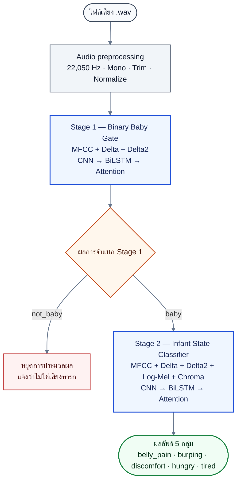

# CryInsight — Two-stage Infant Cry Classification

CryInsight เป็นระบบวิเคราะห์ไฟล์เสียง `.wav` แบบ 2 Stage:

1. **Stage 1 — Binary Baby Gate:** ตรวจว่าเป็นเสียงทารกหรือไม่
2. **Stage 2 — Infant State Classifier:** เมื่อเป็นเสียงทารก จึงจำแนกเป็น 5 กลุ่ม

## System overview



แผนภาพนี้แสดง inference flow ของระบบ ส่วน augmentation, 5-fold validation และ held-out testing เป็นขั้นตอนเฉพาะระหว่างการพัฒนาโมเดล

ผลการฝึกและประเมินโมเดลแต่ละครั้งรวบรวมอยู่ที่ [Experiment Report Hub](./Report/report.md) ส่วนรายละเอียดเชิงเทคนิค เหตุผลของ feature แต่ละชนิด โครงสร้าง neural network และข้อจำกัดสำหรับงานวิจัยอยู่ใน [Architecture.md](./Architecture.md)

## Environment หลัก

โปรเจกต์นี้กำหนด **Python 3.10** เป็น environment หลัก

| รายการ | เวอร์ชันหลัก |
|---|---|
| Python | **3.10** |
| TensorFlow | 2.15.0 |
| NumPy | 1.26.4 |
| librosa | 0.11.0 |
| scikit-learn | 1.7.2 |
| matplotlib | เวอร์ชันที่รองรับ Python 3.10 |

เหตุผลที่ใช้ Python 3.10:

- เป็นเวอร์ชันที่ตรวจสอบร่วมกับ TensorFlow 2.15.0 ในโปรเจกต์นี้แล้ว
- ลดปัญหาความเข้ากันได้ระหว่าง TensorFlow, Keras, NumPy และไลบรารีเสียง
- ทำให้ environment สำหรับฝึกและโหลดโมเดลมี baseline เดียวกัน

ไม่ควรเปลี่ยนไปใช้ Python เวอร์ชันอื่นโดยไม่รัน unit tests, model-build smoke test และตรวจการ save/load โมเดลใหม่ทั้งหมด

## การติดตั้งบน Windows

ตรวจสอบ Python 3.10:

```powershell
& 'C:\Users\Admin\AppData\Local\Programs\Python\Python310\python.exe' --version
```

ผลที่ต้องได้ควรขึ้นต้นด้วย:

```text
Python 3.10
```

### สร้าง virtual environment

รันจากโฟลเดอร์ `D:\INFANT CRY`:

```powershell
& 'C:\Users\Admin\AppData\Local\Programs\Python\Python310\python.exe' -m venv .venv310
& '.\.venv310\Scripts\Activate.ps1'
python -m pip install --upgrade pip
```

### ติดตั้งไลบรารีหลัก

```powershell
python -m pip install tensorflow==2.15.0 numpy==1.26.4 librosa==0.11.0 scikit-learn==1.7.2 matplotlib
```

ตรวจสอบ environment:

```powershell
python -c "import sys, tensorflow, numpy, librosa, sklearn; print(sys.version); print('TensorFlow', tensorflow.__version__); print('NumPy', numpy.__version__); print('librosa', librosa.__version__); print('scikit-learn', sklearn.__version__)"
```

> หากไม่ได้ activate virtual environment ให้ใช้ path ของ Python 3.10 แบบเต็มในทุกคำสั่งตามตัวอย่างส่วนการฝึกโมเดล

## โครงสร้างโปรเจกต์ที่ใช้งานอยู่

```text
INFANT CRY/
├── Architecture.md
├── README.md
├── Report/
│   ├── report.md                   # Experiment Report Hub
│   ├── runs/                       # รายงานถาวรของแต่ละการทดลอง
│   └── assets/                     # ภาพประกอบรายงาน
├── split_audio.py
│
├── data_set_dbl/                  # ข้อมูลต้นฉบับ
├── data_set_dbl_split/
│   ├── train/                     # ใช้สร้าง 5 folds และฝึก
│   └── test/                      # locked held-out test
│
├── Models_dbl/
│   ├── binary/
│   │   └── train_binary_dbl.py    # Stage 1
│   └── Main/
│       └── train_main_dbl.py      # Stage 2
│
├── cryinsight/
│   ├── audio/features.py
│   └── training/
│       ├── protocol.py
│       └── artefacts.py
│
├── models_dbl_OLD/                # โค้ด/artefact รุ่นเดิม ใช้อ้างอิงเท่านั้น
└── tests/
```

trainer รุ่นปัจจุบันจะไม่เขียนทับโมเดลใน `models_dbl_OLD`

## Dataset

โฟลเดอร์ `data_set_dbl` มี 6 label directories:

```text
belly_pain/
burping/
discomfort/
hungry/
tired/
not_baby/
```

- Stage 1 รวม 5 infant labels เป็น `baby` และใช้ `not_baby` เป็นคลาสลบ
- Stage 2 ใช้เฉพาะ 5 infant labels
- ESC-50 หมวด `crying_baby` (target 20) ไม่ถูกนำมาเป็น `not_baby`

## การแบ่งข้อมูล 80/20

สคริปต์ [split_audio.py](./split_audio.py) สุ่มแบ่งไฟล์รายคลาสจาก `data_set_dbl` ไปยัง:

```text
data_set_dbl_split/train
data_set_dbl_split/test
```

ค่าเริ่มต้นคือ train 80%, test 20% และ seed 42

หากยังไม่มี split:

```powershell
& 'C:\Users\Admin\AppData\Local\Programs\Python\Python310\python.exe' split_audio.py
```

หากปลายทางมีข้อมูล สคริปต์จะหยุดเพื่อป้องกันการเขียนทับ หากตั้งใจสร้างใหม่จริงให้ตรวจสอบปลายทางก่อนแล้วจึงใช้:

```powershell
& 'C:\Users\Admin\AppData\Local\Programs\Python\Python310\python.exe' split_audio.py --overwrite
```

`--overwrite` จะลบ `data_set_dbl_split` เดิมก่อนสร้างใหม่ จึงไม่ควรใช้ระหว่างหรือหลังเริ่มการทดลองที่ต้องอ้างอิง split เดิม

การแบ่งนี้เป็น stratified split ระดับไฟล์ ไม่ใช่ระดับทารกหรือ recording session เนื่องจากยังไม่มี `subject_id/session_id` ที่ตรวจสอบได้ครบถ้วน ตัว trainer จึงตรวจ SHA-256 และ group provenance เพิ่มเติม พร้อมสงวนรายการ Test ที่ชนกับ Train ออกจากการฝึก แต่ยังไม่สามารถรับรอง subject-independent evaluation ได้

## Feature และ architecture

### Stage 1 — Binary Baby Gate

```text
MFCC(40) + Delta(40) + Delta2(40)
                 │
                 ▼
       Input (120, 128, 1)
                 │
                 ▼
CNN → BiLSTM → Attention → Softmax(2)
                 │
                 ▼
          not_baby / baby
```

Stage 1 ไม่ใช้ Log-Mel, Chroma หรือ Mixup

### Stage 2 — Five-class Infant State Classifier

```text
MFCC(40) + Delta(40) + Delta2(40) + Log-Mel(64) + Chroma(12)
                              │
                              ▼
                    Input (196, 128, 1)
                              │
                              ▼
              CNN → BiLSTM → Attention → Softmax(5)
```

Stage 2 ใช้ Mixup ค่าเริ่มต้น 500 ตัวอย่างต่อ fold และ `alpha=0.3`

## Augmentation

augmentation ถูกสร้างเฉพาะ training partition ของแต่ละ fold หลังแบ่ง train/validation แล้ว

วิธีที่ training plan ใช้:

- Gaussian noise
- Pitch shift
- Time stretch
- Time shift

Stage 2 มี Mixup เพิ่มหลัง normalization ส่วน validation และ `data_set_dbl_split/test` ไม่มี augmentation

รายการ augmentation ทุกตัวอย่างถูกบันทึกใน:

```text
fold_N/augmentation_manifest.csv
```

## Training protocol

1. อ่านและ hash ข้อมูล `train/test` เพื่อ audit provenance และตรวจ overlap โดยยังไม่ใช้ Test คำนวณผล
2. ให้ locked Test มีสิทธิ์ก่อน และไม่นำ training record ที่ group หรือ SHA-256 ชนกับ Test เข้าเทรน
3. แบ่ง training originals เป็น grouped 5-fold ก่อน augmentation
4. ใน Fold 1–5 สร้าง augmentation เฉพาะ Training partition
5. fit normalizer จาก Training features ของแต่ละ Fold เท่านั้น
6. เลือก checkpoint จาก `val_loss` ของ Fold validation
7. สร้าง OOF prediction จาก original validation records และไม่ประเมิน Test ภายใน Fold
8. สรุปจำนวน Epoch สุดท้ายด้วยค่ามัธยฐานของ `best_epoch` ทั้ง 5 Fold
9. สร้าง Final-refit model ใหม่จาก Train 80% ทั้งหมด พร้อม final-refit normalizer และ augmentation plan ของตนเอง
10. ประเมิน Final-refit model บน locked internal Test 20% เพียงครั้งเดียว

Test ไม่ถูกใช้เลือก architecture, hyperparameters, Epoch, augmentation, normalizer หรือ Final Model ผล OOF ใช้ประเมินกระบวนการพัฒนา ส่วนผล `final_test_*` ใช้ประเมิน Final-refit artefact ภายใน corpus เดียวกัน

## ตรวจข้อมูลโดยไม่เทรน

Stage 1:

```powershell
& 'C:\Users\Admin\AppData\Local\Programs\Python\Python310\python.exe' Models_dbl/binary/train_binary_dbl.py --audit-only
```

Stage 2:

```powershell
& 'C:\Users\Admin\AppData\Local\Programs\Python\Python310\python.exe' Models_dbl/Main/train_main_dbl.py --audit-only
```

โหมด `--audit-only` ไม่สร้าง run และไม่เริ่ม TensorFlow training

## เตรียม run โดยไม่เทรน

```powershell
& 'C:\Users\Admin\AppData\Local\Programs\Python\Python310\python.exe' Models_dbl/binary/train_binary_dbl.py --prepare-only

& 'C:\Users\Admin\AppData\Local\Programs\Python\Python310\python.exe' Models_dbl/Main/train_main_dbl.py --prepare-only
```

โหมดนี้สร้าง audit, fold assignments และ configuration แต่ไม่สร้างโมเดล

## เทรน Stage 1

```powershell
& 'C:\Users\Admin\AppData\Local\Programs\Python\Python310\python.exe' Models_dbl/binary/train_binary_dbl.py --train
```

ค่าเริ่มต้น:

- Epoch สูงสุด: 200
- Batch size: 32
- Learning rate: 0.001
- AdamW weight decay: `1e-4`
- Label smoothing: 0.05
- Early-stopping patience: 25
- Mixup: ไม่ใช้

## เทรน Stage 2

ควรเทรน Stage 1 ให้เสร็จก่อนหากต้องการนำระบบ 2 Stage ไปใช้งานครบ pipeline

```powershell
& 'C:\Users\Admin\AppData\Local\Programs\Python\Python310\python.exe' Models_dbl/Main/train_main_dbl.py --train
```

ค่าเริ่มต้น:

- Epoch สูงสุด: 200
- Batch size: 32
- Learning rate: 0.001
- AdamW weight decay: `1e-4`
- Label smoothing: 0.10
- Early-stopping patience: 30
- Mixup: 500 samples/fold, alpha 0.3

สามารถระบุ run ID ได้ เช่น:

```powershell
& 'C:\Users\Admin\AppData\Local\Programs\Python\Python310\python.exe' Models_dbl/binary/train_binary_dbl.py --train --run-id stage1_seed42
```

run ID ต้องไม่ซ้ำ เพราะ run directories เป็น immutable

## ผลลัพธ์หลังเทรน

Stage 1:

```text
Models_dbl/binary/runs/<run_id>/
```

Stage 2:

```text
Models_dbl/Main/runs/<run_id>/
```

โครงสร้างสำคัญ:

```text
runs/<run_id>/
├── fold_1/
├── fold_2/
├── fold_3/
├── fold_4/
├── fold_5/
├── best_model/
│   ├── best_model_*_dbl.keras
│   ├── norm_stats_*_dbl.npy
│   ├── norm_stats_*_dbl.npy.metadata.json
│   ├── labels_*_dbl.json
│   ├── preprocessing_config.json
│   ├── augmentation_manifest.csv
│   ├── class_counts.json
│   ├── history.csv
│   ├── final_refit_manifest.json
│   └── deployment_manifest.json
├── oof_metrics.json
├── oof_predictions.csv
├── fold_metrics.csv
├── final_test_predictions.csv
├── final_test_metrics.json
├── final_test_confusion_matrix.csv
├── final_test_confusion_matrix.png
├── final_test_manifest.json
└── verification.json
```

ภายในแต่ละ `fold_N` มี:

- `fold_N_binary_dbl.keras` หรือ `fold_N_main_dbl.keras`
- normalizer และ metadata
- training history
- validation predictions/metrics
- augmentation manifest
- fold manifest

โมเดลสำหรับนำไปใช้งานอยู่ที่:

```text
best_model/best_model_binary_dbl.keras
best_model/best_model_main_dbl.keras
```

`best_model` ไม่ใช่สำเนาของ Fold ที่คะแนนดีที่สุด แต่เป็น Final-refit model ที่เทรนใหม่ด้วย Train 80% ทั้งหมดตามจำนวน Epoch มัธยฐานจาก 5 Fold ต้องใช้ model พร้อม normalizer, labels และ `preprocessing_config.json` จาก bundle เดียวกัน

## Metrics

ระบบบันทึก:

- Accuracy
- Balanced accuracy
- Macro precision/recall/F1
- Weighted F1
- ROC-AUC เมื่อคำนวณได้
- Sensitivity และ Specificity สำหรับ Stage 1
- Log loss, Brier score และ Expected Calibration Error (ECE) เพื่อวินิจฉัย calibration
- Classification report
- Confusion matrix
- 95% group-bootstrap confidence intervals เมื่อ group structure รองรับ

README นี้ไม่ระบุค่า accuracy ล่วงหน้า เพราะค่าที่รายงานต้องมาจาก run ที่ฝึกเสร็จจริงและ `verification.json` มีสถานะ `complete`

ผล validation ภายใน 5-fold อยู่ใน `oof_metrics.json` ส่วนผลประเมิน Final-refit model บน locked internal Test ครั้งเดียวอยู่ใน `final_test_metrics.json`

## รัน unit tests

```powershell
& 'C:\Users\Admin\AppData\Local\Programs\Python\Python310\python.exe' -m unittest discover -s tests -v
```

baseline ที่ตรวจล่าสุดผ่าน 63 tests

## ปัญหาที่พบบ่อย

### `ModuleNotFoundError: No module named 'librosa'`

ตรวจว่าใช้ Python 3.10 environment ที่ติดตั้ง dependencies แล้ว:

```powershell
python -m pip install librosa==0.11.0
```

### `ModuleNotFoundError: No module named 'sklearn'`

```powershell
python -m pip install scikit-learn==1.7.2
```

### TensorFlow import ไม่ได้

ตรวจว่า interpreter เป็น Python 3.10 และติดตั้ง TensorFlow ใน interpreter เดียวกัน:

```powershell
python --version
python -m pip show tensorflow
```

### Audio สั้นเกินไป

feature contract ปัจจุบันจะเติมศูนย์ทางขวาจนถึงจำนวน sample ขั้นต่ำสำหรับ Delta window หากยังเกิด error ให้ดู `record_id` และ `filepath` ที่ trainer รายงานเพื่อตรวจว่าไฟล์เสียหรือถอดรหัสไม่ได้

### ไม่พบ accuracy

accuracy จะไม่มีจนกว่า training run จะจบครบ 5 folds ตรวจ `verification.json` หากสถานะเป็น `incomplete` ต้องใช้ run ใหม่ ไม่ควรเขียนทับ run เดิม

## การตีความผลวิจัย

- `data_set_dbl_split/test` เป็น locked internal held-out test สำหรับ run ใหม่ ไม่ใช่ external validation เพราะมาจาก corpus เดียวกับ Train และ corpus นี้เคยถูกใช้พัฒนาโมเดลเก่ามาก่อน
- ยังไม่มี subject/session identifiers ที่ยืนยันครบ จึงไม่ควรอ้างว่าเป็น subject-independent evaluation
- Stage 1 ใช้เสียงทารกและ `not_baby` จากคนละแหล่งข้อมูล จึงมีความเสี่ยงต่อ dataset-source bias
- Stage 2 มี class imbalance สูง และบางคลาสต้องพึ่ง synthetic augmentation จำนวนมาก จึงควรมี ablation study ก่อนกล่าวอ้างว่า augmentation ช่วยเพิ่มผลลัพธ์
- คะแนน Softmax เป็น uncalibrated model score ไม่ใช่ calibrated probability หรือโอกาสถูกต้องทางการแพทย์
- label ทั้ง 5 ของ Stage 2 เป็นกลุ่มตาม dataset ไม่ใช่การวินิจฉัยทางการแพทย์
- ผล Stage 1 และ Stage 2 แยกกันยังไม่ใช่การประเมิน end-to-end cascade ของระบบใช้งานจริง
- ต้องตรวจ citation, annotation provenance, license, consent และ ethics ของ Dataset จากแหล่งต้นฉบับก่อนส่งตีพิมพ์

## License

ตรวจสอบสิทธิ์ของ source code และ dataset แต่ละแหล่งก่อนแจกจ่ายหรือตีพิมพ์ผล เนื่องจาก license ของ dataset อาจแตกต่างจาก license ของตัวโปรเจกต์
