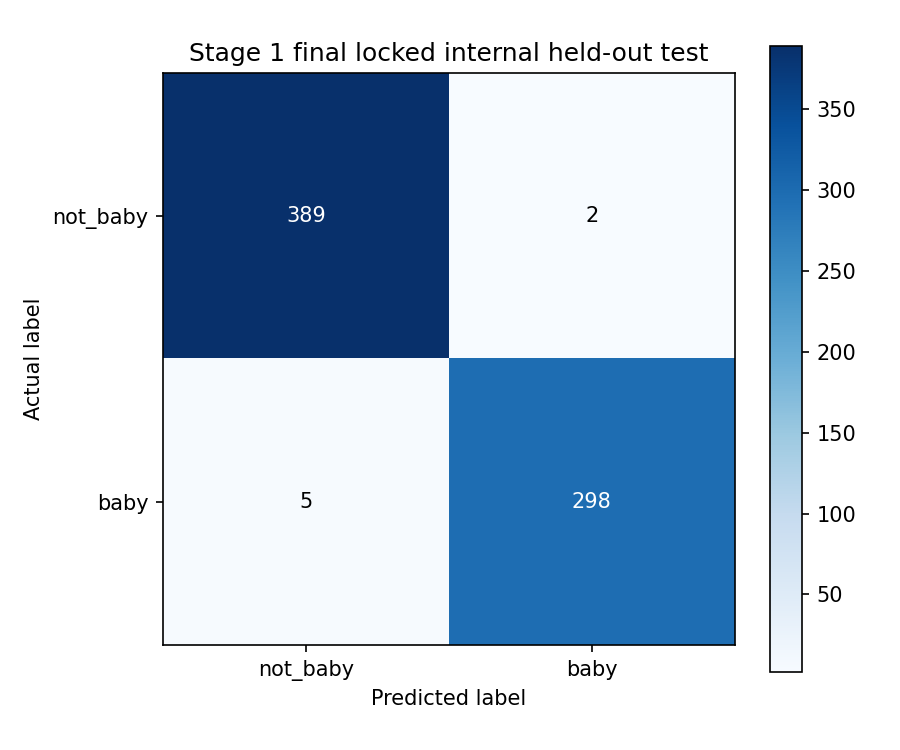
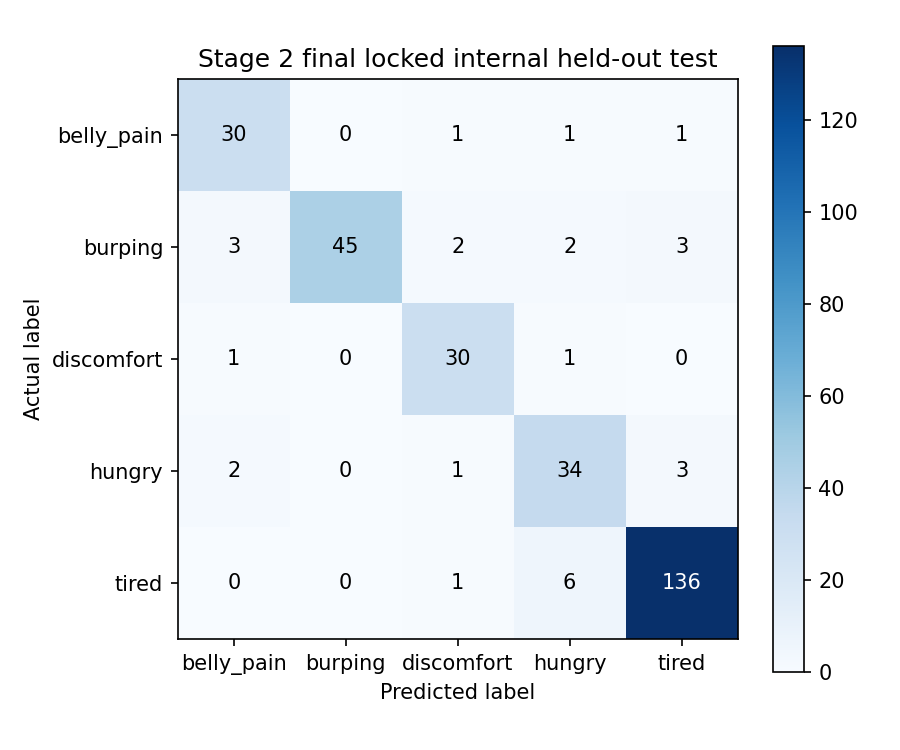

# CryInsight Training and Evaluation Report — ครั้งที่ 1

วันที่จัดทำรายงาน: 16 สิงหาคม 2026  
ขอบเขต: Stage 1 Binary Baby Gate และ Stage 2 Five-class Infant State Classifier

[กลับ Report Hub](../report.md) · [README](../../README.md) · [Architecture](../../Architecture.md)

## 1. บทสรุปผลการทดลอง

การทดลองครั้งนี้ฝึกโมเดลด้วยข้อมูลใน `data_set_dbl_split/train` โดยใช้ grouped five-fold cross-validation สำหรับการประเมินภายใน จากนั้นเลือกจำนวน epoch ของ Final-refit ด้วยค่ามัธยฐานของ `best_epoch` ทั้ง 5 Folds ฝึกโมเดลใหม่จาก Train ทั้งหมด และเปิด `data_set_dbl_split/test` ประเมินเพียงครั้งเดียวหลัง Final Model ถูกสร้างแล้ว

| รายการ | Stage 1 | Stage 2 |
|---|---:|---:|
| OOF support | 2,432 | 1,045 |
| OOF accuracy | 98.93% | 90.14% |
| Final Test support | 694 | 303 |
| Final Test accuracy | 98.99% | 90.76% |
| Final Test Macro F1 | 98.97% | 88.51% |
| Final epoch | 38 | 60 |
| Verification | `complete` | `complete` |

Stage 1 ให้ผล internal held-out สูงและสม่ำเสมอกับ OOF validation ส่วน Stage 2 มีผลรวมที่ดีแต่ยังมีความแตกต่างระหว่างคลาส โดย `hungry` มี precision ต่ำสุดและ `burping` มี recall ต่ำสุด ผลนี้ยังไม่ใช่หลักฐาน external generalizability

## 2. Run ที่ใช้ในรายงาน

| Stage | Run ID | บทบาทโมเดล | Evaluation scope |
|---|---|---|---|
| Stage 1 | `20260816T092253Z_e1fe86b3` | `final_refit` | `locked_internal_heldout_test` |
| Stage 2 | `20260816T102950Z_a16c5a1d` | `final_refit` | `locked_internal_heldout_test` |

ทั้งสอง run มี `verification.json` สถานะ `complete`, เทรนครบ 5 Folds และประเมิน Test หนึ่งครั้งโดยไม่ใช้ Test เลือก epoch, hyperparameter หรือ deployment model

## 3. Training protocol

```text
Train 80%
  → grouped five-fold cross-validation
  → เก็บ OOF predictions ของ original records
  → เลือก best checkpoint ของแต่ละ Fold ด้วย val_loss
  → หาค่ามัธยฐาน best_epoch ทั้ง 5 Folds
  → ฝึก Final-refit model ใหม่จาก Train ทั้งหมด
  → บันทึก Final Model และ Web App bundle
  → เปิด locked Test 20% ประเมินครั้งเดียว
```

Normalizer ถูก fit จาก Training features ของขอบเขตที่เกี่ยวข้องเท่านั้น Augmentation ใช้เฉพาะ Training partition และไม่มี augmented record อยู่ใน OOF หรือ Final Test

## 4. ข้อมูลและการทำ Augmentation

### Stage 1

| Label | Original Train | Generated augmentation | Final pre-training count |
|---|---:|---:|---:|
| `baby` | 1,048 | 336 | 1,384 |
| `not_baby` | 1,384 | 0 | 1,384 |
| รวม | 2,432 | 336 | 2,768 |

Stage 1 ไม่ใช้ Mixup และไม่ใช้ class weight ใน Final-refit

Final Test ประกอบด้วย `baby` 303 และ `not_baby` 391 รวม 694 original records

### Stage 2

| Label | Original Train | Generated augmentation | Final pre-Mixup count |
|---|---:|---:|---:|
| `belly_pain` | 117 | 394 | 511 |
| `burping` | 175 | 336 | 511 |
| `discomfort` | 97 | 414 | 511 |
| `hungry` | 145 | 366 | 511 |
| `tired` | 511 | 0 | 511 |
| รวม | 1,045 | 1,510 | 2,555 |

หลัง target-based augmentation มีการเพิ่ม Mixup 500 samples ด้วย `alpha=0.3` และไม่ใช้ class weight ใน Final-refit

Final Test ประกอบด้วย `belly_pain` 33, `burping` 55, `discomfort` 32, `hungry` 40 และ `tired` 143 รวม 303 original records

## 5. การเลือก Final epoch

### Stage 1

| Fold | Best epoch | Selected checkpoint val_loss |
|---:|---:|---:|
| 1 | 38 | 0.136693 |
| 2 | 57 | 0.135708 |
| 3 | 47 | 0.135310 |
| 4 | 20 | 0.164666 |
| 5 | 28 | 0.161700 |

ค่ามัธยฐานของ `[38, 57, 47, 20, 28]` เท่ากับ 38 epochs

### Stage 2

| Fold | Best epoch | Selected checkpoint val_loss |
|---:|---:|---:|
| 1 | 58 | 0.644198 |
| 2 | 85 | 0.634066 |
| 3 | 67 | 0.592366 |
| 4 | 60 | 0.593372 |
| 5 | 56 | 0.691563 |

ค่ามัธยฐานของ `[58, 85, 67, 60, 56]` เท่ากับ 60 epochs

## 6. OOF internal validation

| Metric | Stage 1 | Stage 2 |
|---|---:|---:|
| Support | 2,432 | 1,045 |
| Accuracy | 98.93% | 90.14% |
| Balanced accuracy | 98.92% | 86.62% |
| Macro precision | 98.90% | 87.10% |
| Macro recall | 98.92% | 86.62% |
| Macro F1 | 98.91% | 86.83% |
| Weighted F1 | 98.93% | 90.13% |
| Log loss | 0.0484 | 0.3553 |
| Brier score | 0.0186 | 0.1540 |
| ECE | 0.0137 | 0.0396 |

OOF predictions ครอบคลุม expected original records ครบทั้งหมด โดยมี missing records 0 และ duplicate predictions 0 ในทั้งสอง Stage

## 7. Final Test results

| Metric | Stage 1 | Stage 2 |
|---|---:|---:|
| Support | 694 | 303 |
| Accuracy | 98.99% | 90.76% |
| Accuracy 95% CI | 98.15–99.71% | 87.46–93.73% |
| Balanced accuracy | 98.92% | 89.32% |
| Macro precision | 99.03% | 88.29% |
| Macro recall | 98.92% | 89.32% |
| Macro F1 | 98.97% | 88.51% |
| Weighted F1 | 98.99% | 90.84% |
| Log loss | 0.0497 | 0.3557 |
| Brier score | 0.0191 | 0.1521 |
| ECE | 0.0236 | 0.0381 |

Confidence intervals คำนวณด้วย group-percentile bootstrap 2,000 iterations, seed 42 ผล Test ไม่ได้ถูกใช้เลือกโมเดลและถูกประเมินหนึ่งครั้งต่อ Stage

## 8. Stage 1 — ผลรายคลาส

| Label | Precision | Recall | F1 | Support |
|---|---:|---:|---:|---:|
| `baby` | 99.33% | 98.35% | 98.84% | 303 |
| `not_baby` | 98.73% | 99.49% | 99.11% | 391 |

Stage 1 ทำนายถูก 687 จาก 694 records และผิด 7 records ประกอบด้วย `not_baby` ถูกทำนายเป็น `baby` 2 records และ `baby` ถูกทำนายเป็น `not_baby` 5 records



## 9. Stage 2 — ผลรายคลาส

| Label | Precision | Recall | F1 | Support | ทำนายถูก |
|---|---:|---:|---:|---:|---:|
| `belly_pain` | 83.33% | 90.91% | 86.96% | 33 | 30 |
| `burping` | 100.00% | 81.82% | 90.00% | 55 | 45 |
| `discomfort` | 85.71% | 93.75% | 89.55% | 32 | 30 |
| `hungry` | 77.27% | 85.00% | 80.95% | 40 | 34 |
| `tired` | 95.10% | 95.10% | 95.10% | 143 | 136 |

Stage 2 ทำนายถูก 275 จาก 303 records และผิด 28 records จุดที่ควรติดตามคือ `hungry` precision 77.27% ซึ่งมี false positives มากที่สุดในเชิงสัดส่วน และ `burping` recall 81.82% ซึ่งพลาด 10 จาก 55 records



## 10. การตรวจความสมบูรณ์ของ Run

| การตรวจ | Stage 1 | Stage 2 |
|---|---:|---:|
| `verification.json` | `complete` | `complete` |
| Folds completed | 5 | 5 |
| OOF missing | 0 | 0 |
| OOF duplicates | 0 | 0 |
| Final Test prediction rows | 694 | 303 |
| Unique Test record IDs | 694 | 303 |
| Test sample kind | `original` | `original` |
| Test prediction identity | `final_refit` | `final_refit` |
| Artifact SHA-256 checked | 31 | 31 |
| Missing artifact | 0 | 0 |
| SHA-256 mismatch | 0 | 0 |

ผลตรวจไม่พบ prediction หาย, prediction ซ้ำ, augmented Test record, artifact สูญหาย หรือ hash mismatch

## 11. ปัญหาและข้อจำกัดที่พบ

### 11.1 Probability normalization warning

ระหว่างคำนวณ metrics มีคำเตือนจาก scikit-learn ว่า probability บางแถวรวมไม่เท่ากับหนึ่ง การตรวจ prediction จริงพบความคลาดเคลื่อนสูงสุดประมาณ `8.57×10⁻⁸` ใน Stage 1 และ `1.60×10⁻⁷` ใน Stage 2 ซึ่งเกิดจาก floating-point rounding ระหว่างค่า Softmax แบบ float32 กับการตรวจ tolerance แบบ float64 ไม่พบ probability ผิดช่วงหรือข้อมูลเสีย และไม่มีผลเชิงสาระต่อ metrics ของ run นี้ อย่างไรก็ตามควร normalize probability รายแถวก่อนคำนวณ metrics ในการปรับโค้ดครั้งถัดไปเพื่อไม่ให้เกิด warning

### 11.2 Stage 1 source confounding

เสียง `baby` มาจาก InfantCry-DBL ขณะที่ `not_baby` มาจาก ESC-50 โมเดลอาจเรียนรู้ลักษณะการบันทึกหรือแหล่ง Dataset บางส่วนแทน semantic class ดังนั้น accuracy สูงของ Stage 1 ต้องตีความภายในขอบเขต Dataset นี้

### 11.3 File-level split และ subject identity

การแบ่ง 80/20 เดิมทำระดับไฟล์ และไม่มี subject/session identifiers ที่ยืนยันได้ครบถ้วน การตรวจ hash และ group ป้องกัน exact-content overlap ได้ แต่ยังไม่รับประกัน subject-independent evaluation

### 11.4 Stage 2 class imbalance

Original Train มีตั้งแต่ 97 records ใน `discomfort` ถึง 511 records ใน `tired` Augmentation และ Mixup ช่วยสมดุลจำนวน training samples แต่ไม่ได้สร้าง independent biological observations ใหม่ ผลรายคลาสจึงสำคัญกว่า accuracy รวมเพียงค่าเดียว

### 11.5 Calibration และการตีความคะแนน

Log loss, Brier score และ ECE เป็น calibration diagnostics คะแนน Softmax ยังเป็น uncalibrated model score และห้ามตีความเป็นโอกาสถูกต้องเชิงการแพทย์

### 11.6 Evaluation scope

Train และ Test มาจาก corpus เดียวกัน และ corpus เคยถูกใช้พัฒนาโมเดล legacy มาก่อน ผลนี้จึงเป็น `locked internal held-out test for the frozen new run` ไม่ใช่ external validation นอกจากนี้ผล Stage 1 และ Stage 2 ยังถูกประเมินแยกกัน ไม่ใช่ end-to-end cascade evaluation

### 11.7 Dataset documentation

ก่อนส่งตีพิมพ์ต้องตรวจ dataset citation, annotation procedure, inter-rater reliability, license, consent และ ethics จากแหล่งต้นฉบับให้ครบถ้วน กลุ่ม Stage 2 เป็น operational labels ตาม Dataset ไม่ใช่การวินิจฉัยทางคลินิก

## 12. โมเดลและผลลัพธ์หลัก

### Stage 1

- [Web App bundle](../../Models_dbl/binary/runs/20260816T092253Z_e1fe86b3/best_model/)
- [Final model](../../Models_dbl/binary/runs/20260816T092253Z_e1fe86b3/best_model/best_model_binary_dbl.keras)
- [Final Test metrics](../../Models_dbl/binary/runs/20260816T092253Z_e1fe86b3/final_test_metrics.json)
- [Verification](../../Models_dbl/binary/runs/20260816T092253Z_e1fe86b3/verification.json)

### Stage 2

- [Web App bundle](../../Models_dbl/Main/runs/20260816T102950Z_a16c5a1d/best_model/)
- [Final model](../../Models_dbl/Main/runs/20260816T102950Z_a16c5a1d/best_model/best_model_main_dbl.keras)
- [Final Test metrics](../../Models_dbl/Main/runs/20260816T102950Z_a16c5a1d/final_test_metrics.json)
- [Verification](../../Models_dbl/Main/runs/20260816T102950Z_a16c5a1d/verification.json)

## 13. ข้อสรุป

Run ครั้งที่ 1 ผ่าน integrity checks ที่กำหนดและสามารถใช้เป็นผล corrected internal validation ของโครงการได้ Stage 1 มี Final Test accuracy 98.99% และ Stage 2 มี Final Test accuracy 90.76% แต่ข้อจำกัดเรื่องแหล่ง Dataset, subject identity, class imbalance และ external validation ต้องถูกเปิดเผยทุกครั้งที่นำผลไปใช้หรือรายงานเชิงวิจัย

